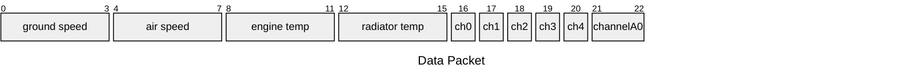

# Arduino Sensor Controller Firmware

The code within runs the Arduino Nano microcontroller that is included in the Supermileage data display and acquisition system. It takes in all of our sensor inputs, packages them up, and sends them to the Raspberry Pi over serial for further processing.

## Sensor Channels

### Channel Configuration

The following chart outlines all of the data channels that the firmware handles, and how they are set up.

| Channel   | Input/Output | Arduino Pin | Flexible? | Notes |
| --------- | ------------ | ----------- | --------- | ----- |
| Speed     | Input        | 2           | No        | Requires special processing that has to be done arduino-side |
| Temp      | Input        | N/A         | No        | This is not an I/O pin, and all temp chjannels can be on one pin |
| Wind      | Input        | A2          | No        | Requires special processing that has to be done arduino-side |
| Channel0  | Input        | 4           | Yes       | currently user input |
| Channel1  | Input        | 5           | Yes       | currently user input |
| Channel2  | Input        | 6           | Yes       |  |
| Channel3  | Input        | 7           | Yes       | currently a switch pin |
| Channel4  | Input        | 8           | Yes       | currently a switch pin |
| Channel5  | Output       | 10          | Yes       | currently radiator fan out |
| Channel6  | Output       | 11          | Yes       | currently water pump out |
| Channel7  | Output       | 12          | Yes       |  |
| ChannelA0 | Input        | A7          | Yes       | currently battery voltage |

### Hardcoded Channel Justifications

While the goal was to generalize all of the data channels for flexiblity, some sensor inputs need to be handled on the Arduino. Below is a list of sensors with hardcoded channels, and why they were kept that way.

- Speed: the speed measurements are interrupt driven, so the calculation needs to be done on the Arduino as close to the interrupt as possible.
- Temp: The temperature probes we use utilize serial communication with the Arduino, so it is easiest to manage this communication locally and then forward the data.
- Wind: there are specific adjustments that must be made to this input that are directly related to the hardware and can vary per-run, so this should be managed locally.

## Sensor Data Packet Details

Our sensor data is packaged up in a data struct to be as compact as possible for transmission over the serial bus. As such, here is the breakdown of the packet data that would have to be parsed on the Raspberry Pi.

Note: The struct is built with the `packed` attribute, meaning that there are no padding bytes for alignment as you would normally expect. THis was done to minimize the amount of data sent per packet.

Total Packet Size: **23 Bytes**

